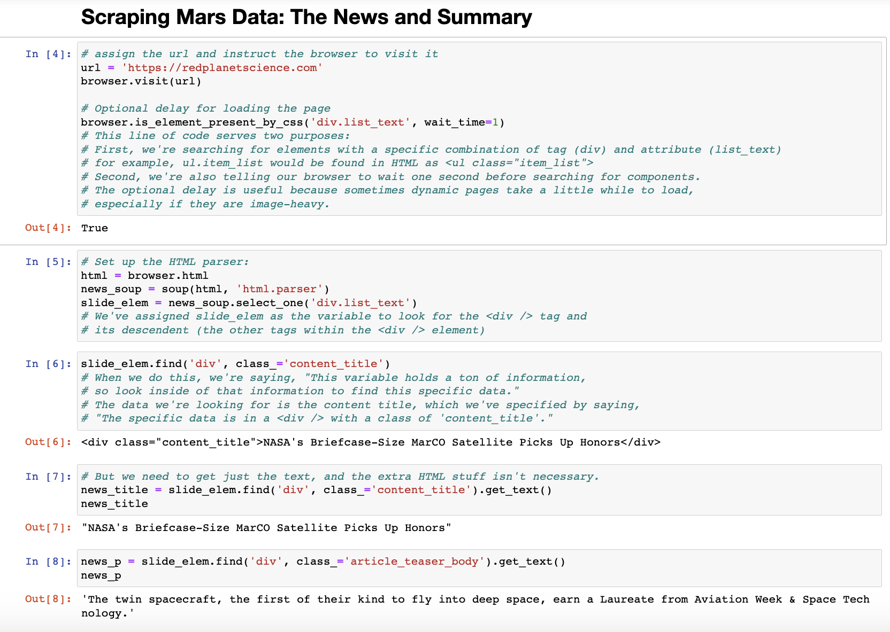

# Mars Rover Web Scraping App

## Objective
Build a web application that scrapes various websites for data related to the Mission to Mars and displays the following information in a single HTML page:
    * Latest News
    * Featured Image
    * Facts about the planet
    * Images of the hemispheres

## 1. Scraping Mars Data: The News
The data I want to collect from the url is the most recent news article along its summary. The code for this will eventually be used in an application that will scrape live data with the click of a button. The website is dynamic and the articles will change frequently.

