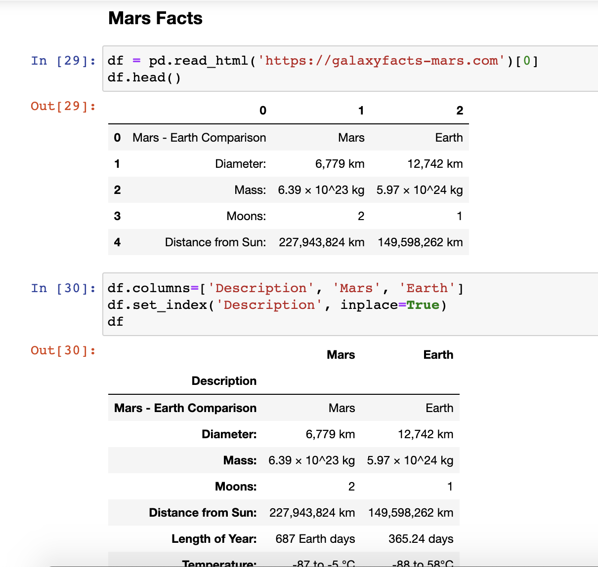

# Mars Rover Web Scraping App

## Objective
Build a web application that scrapes various websites for data related to the Mission to Mars and displays the following information in a single HTML page:
* Latest News
* Featured Image
* Facts about the planet
* Images of the hemispheres

## 1. Scraping Mars Data
Followings are what I scraped from the different websites for various information about Mars.

### NASA Mars News 
* Scraped the [NASA Mars News Site](https://redplanetscience.com)

### JPL Mars Space Images - Featured Image
* Visited the url for JPL Featured Space Image [here](https://spaceimages-mars.com)
* Used Splinter to navigate the site and find the image url for the current Featured Mars Image and assign the url string to a variable called `img_url`

### Mars Facts
* Visited [the Mars Facts webpage](https://galaxyfacts-mars.com/)
* Used Pandas to convert the data to a HTML table string

### Mars Hemispheres
* Visited the [GUSS Science Center website](https://marshemispheres.com/) to obtain high resolution images for each of Mars' hemispheres
* Select hemisphere links to find image url to the full resolution image
* Saved both the image url string for the full resolution hemisphere image, and the hemisphere title containing the hemisphere name.
* Used a Python dictionary to store the data using the keys `img_url` and `title`.
* Append the dictionary with the image url string and the hemisphere title to a list. This list will contain one dictionary for each hemisphere

